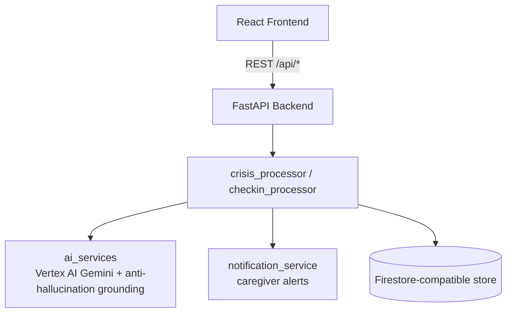

# Recovery & Prevention Hub

> A GenAI-powered recovery and prevention platform for individuals navigating substance use disorders and their caregivers.

Full spec: [`spec.md`](./spec.md) · Manual test log: [`TESTING.md`](./TESTING.md) · Demo walkthrough: [`demo_guide.md`](./demo_guide.md)

## Architecture



- **Backend:** FastAPI (Python 3.11) — `backend/app`. Grounded-generation guardrails live in `app/services/ai_services.py::_is_grounded`.
- **Frontend:** React 18 + TypeScript + Vite — `frontend/src`. Zero-typing Crisis Mode, Safety Plan, Recovery Co-Pilot, Caregiver Dashboard.

## Local Setup

### Backend
```powershell
cd backend
python -m venv venv
.\venv\Scripts\Activate.ps1
pip install -r requirements.txt
copy .env.example .env
uvicorn app.main:app --reload --port 8080
```

### Frontend
```powershell
cd frontend
npm install
npm run dev
```
Open `http://localhost:5173`.

## Running Tests
```powershell
cd backend
.\venv\Scripts\Activate.ps1
pytest -v
```
33 tests covering emergency script grounding, anti-hallucination rejection, caregiver alerts, check-ins, RBAC, and full API integration flows.

## Generative AI Usage (Mandatory — spec.md Section 4.8)

Emergency script generation, coping-technique suggestion, Recovery Co-Pilot Q&A, and educational summarization all call **real Vertex AI Gemini** when `USE_MOCK_AI=false`, authenticated via Application Default Credentials (no API key). Every output is verified as grounded in the user's actual Recovery Profile / knowledge base before being surfaced — ungrounded content is rejected in favor of an explicit "not grounded" message (see `_is_grounded` in `app/services/ai_services.py`).

To enable real Gemini calls:
```
USE_MOCK_AI=false
GCP_PROJECT_ID=your-real-project-id
GCP_REGION=us-central1
```
Requires `pip install -r requirements.txt` (includes `google-cloud-aiplatform`) and a Cloud Run/local service account with `roles/aiplatform.user`.

## Live Demo Integrity (Mandatory — spec.md Section 4.9)

The judged demo must run fully live: `USE_MOCK_AI=false` and `SEED_DEMO_DATA=false`. The app starts with real user accounts but **zero** pre-written profiles/crisis history — every artifact shown during judging is generated live via the UI. See `demo_guide.md` for the full walkthrough.

## Deploying to GCP (Cloud Run)

```powershell
# Backend (build context = repo root, so demo_data/ is included)
gcloud builds submit --config=backend/cloudbuild.yaml --substitutions=_IMAGE=us-central1-docker.pkg.dev/PROJECT/recovery-hub/backend:latest .
gcloud run deploy recovery-hub-backend --image=us-central1-docker.pkg.dev/PROJECT/recovery-hub/backend:latest --region=us-central1 --allow-unauthenticated --set-env-vars="USE_MOCK_AI=false,SEED_DEMO_DATA=false,GCP_PROJECT_ID=PROJECT,GCP_REGION=us-central1"

# Frontend (bake backend URL in at build time)
cd frontend
gcloud builds submit --tag us-central1-docker.pkg.dev/PROJECT/recovery-hub/frontend:latest .
gcloud run deploy recovery-hub-frontend --image=us-central1-docker.pkg.dev/PROJECT/recovery-hub/frontend:latest --region=us-central1 --allow-unauthenticated
```

Grant the Cloud Run service account Vertex AI access:
```powershell
gcloud projects add-iam-policy-binding PROJECT --member="serviceAccount:PROJECT_NUMBER-compute@developer.gserviceaccount.com" --role="roles/aiplatform.user"
```

## Security Notes

- CORS restricted via `ALLOWED_ORIGINS` env var.
- RBAC: `app/auth.py` — only the profile owner or a linked caregiver can access a Recovery Profile.
- No hardcoded secrets; all credentials via env vars / Secret Manager in production.
- Safety guardrail: the app never discourages seeking real emergency/professional help.
