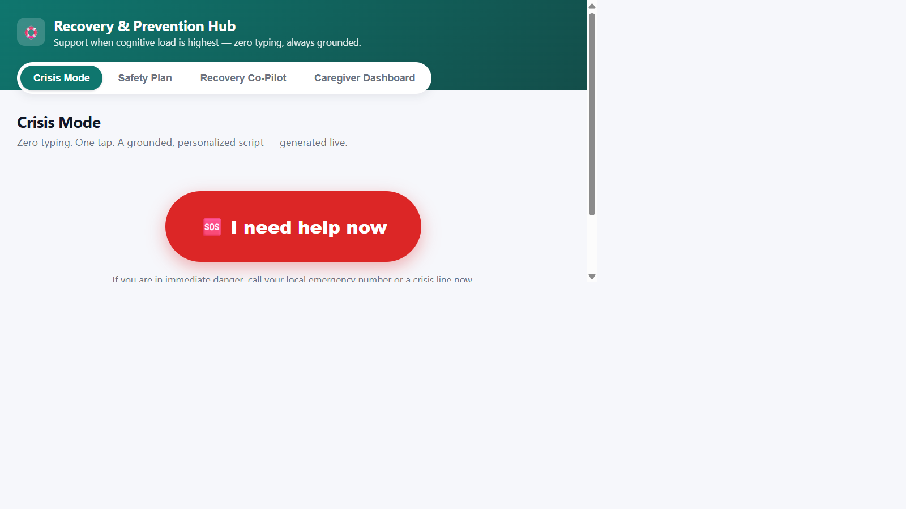
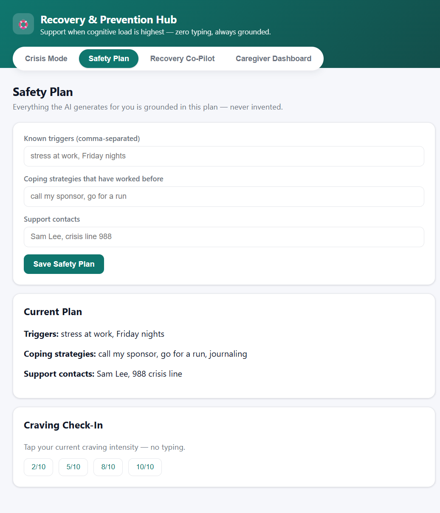
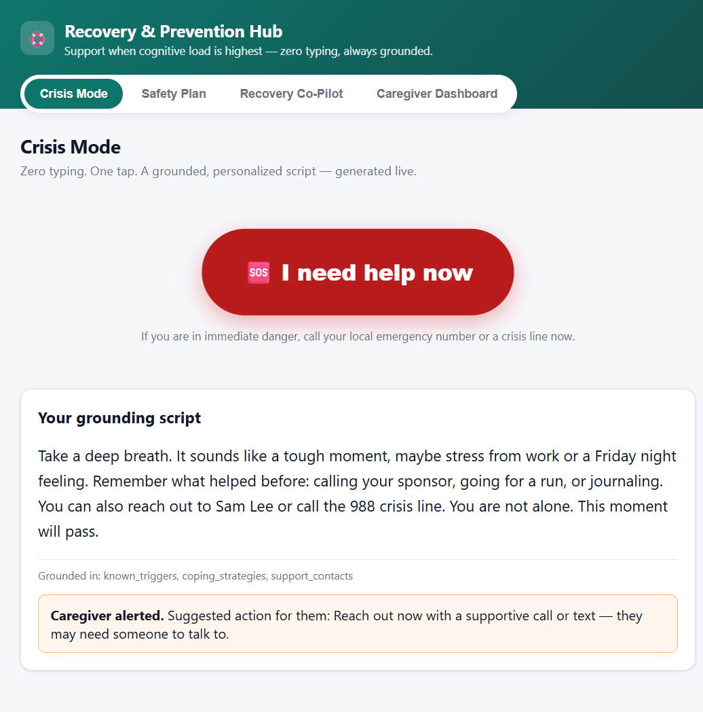
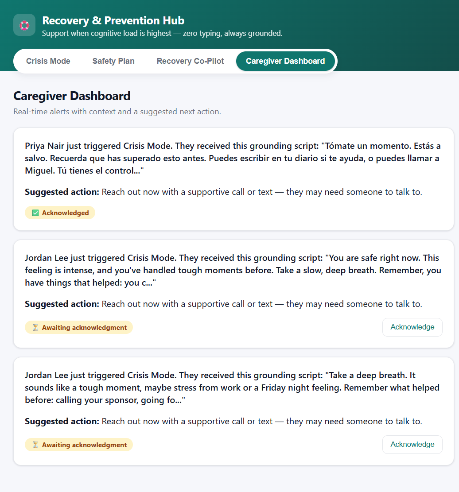
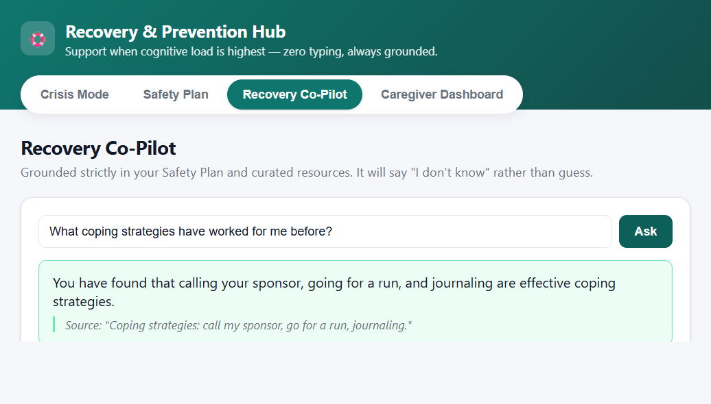
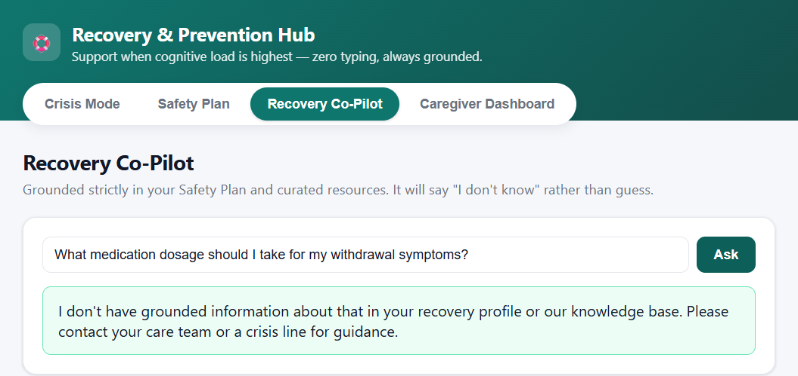
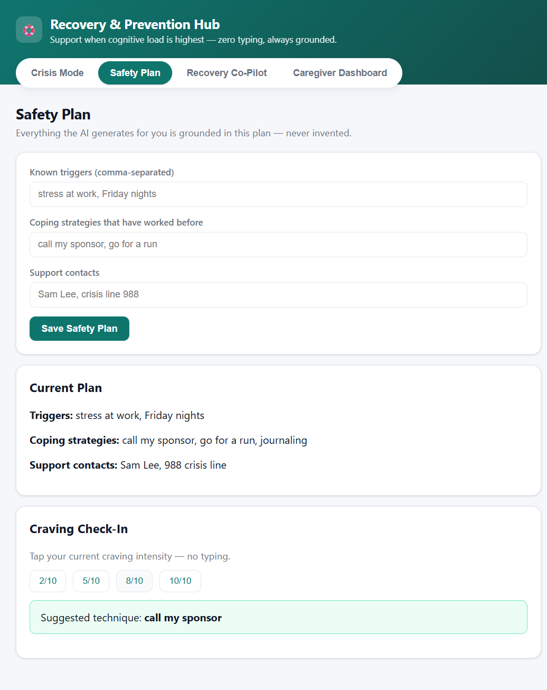

# Demo Guide — Recovery & Prevention Hub

> Per spec.md Section 4.9 (Live Demo Integrity — Mandatory): the judged session must be
> fully live. No static/hardcoded pages, no mock data presented as live, no false
> positives, no hallucinated AI responses.

## 0. Live Verification Status (2026-07-25)

Two full rehearsal passes were run against the deployed environment
(`recovery-hub-backend` + `recovery-hub-frontend` on Cloud Run,
`USE_MOCK_AI=false` + `SEED_DEMO_DATA=false`): first at the API level, then a
full **browser click-through** of the actual judged URL
(https://recovery-hub-frontend-566288522012.us-central1.run.app/) covering
every step below, with screenshots captured live (see `docs/screenshots/` and
embedded inline in Section 2). **Every check passed** — see `TESTING.md` →
"Live Deployment Verification" for full request/response evidence. Highlights:

- Crisis trigger → grounded script + caregiver alert: **4.02 seconds end-to-end** (target: <30s)
- The `Grounded in:` trace correctly listed `known_triggers, coping_strategies, support_contacts`
  after the script referenced the user's actual triggers, coping strategies, and contacts
- Anti-hallucination guardrail correctly refused a clinical/medication question in the live UI
- Multi-language flow (Spanish profile) produced a real translated script + caregiver alert
- Caregiver Dashboard acknowledgment flow worked end-to-end in the browser
- Cloud Run logs confirmed **zero `[MOCK...]`-prefixed output** anywhere during either run
- One real bug was found and fixed during the API-level pass: caregiver-alert translation was
  silently falling back to `[MOCK-ES]` when the API key lacked Translation scope; it now
  retries via Vertex AI/ADC first (see `TESTING.md` for details) — redeployed and re-verified
  in the browser pass with no mock output.

## 1. Pre-Demo Checklist

- [x] Backend deployed/running with `USE_MOCK_AI=false` and `SEED_DEMO_DATA=false`
- [x] Confirm `/health` returns `{"status":"ok"}` and `GET /api/users` returns real accounts
      while crisis/profile endpoints start empty
- [x] Frontend deployed/running and pointed at that backend
- [x] Rehearse the full live flow at least twice **in the UI** with real, unscripted profiles —
      completed 2026-07-25 end-to-end in the browser at the judged URL (see Section 0 and the
      screenshots throughout Section 2)
- [x] `pytest -q` green (33 passed in 0.49s) — offline/mocked tests only, not a substitute for the live run
- [ ] After any redeploy, recreate at least one real profile via the UI before judges arrive —
      the backend's in-memory store is wiped on every deploy (this is expected/desired per
      Section 4.9 — it guarantees no stale pre-seeded data survives into the judged session)
- [ ] Note for presenter: the Gemini call path tries a restricted API key first, then
      automatically retries via Vertex AI (ADC) if that call fails — either way the result is
      always live, never mocked. No action needed unless both paths fail (see Troubleshooting).

## 2. Step-by-Step Walkthrough (Fully Live)

> All screenshots below were captured live against
> https://recovery-hub-frontend-566288522012.us-central1.run.app/ on 2026-07-25
> and are stored in `docs/screenshots/`. They are for presenter rehearsal
> reference only — during actual judging, perform every step live in the
> browser rather than showing these images.

### Step 1 — Problem Intro
**Say:** "When cognitive load is highest — a craving, a panic moment — typing or navigating a menu is the wrong interaction model. Everything you're about to see is generated live against real Gemini."



*This is the very first thing a user sees — one large tap target, zero forms, and a persistent reminder to call real emergency services if needed.*

### Step 2 — Build a Real Safety Plan
**Do:** In the Safety Plan tab, live-enter real triggers, coping strategies, and a support contact for a real user account. Save it.



*Screenshot captured live at https://recovery-hub-frontend-566288522012.us-central1.run.app/ on 2026-07-25 — triggers `stress at work, Friday nights`, coping strategies `call my sponsor, go for a run, journaling`, support contacts `Sam Lee, 988 crisis line`, all entered and saved via the UI (no typing shortcuts, no seeded data).*

### Step 3 — Zero-Typing Crisis Trigger
**Say:** "One tap. No typing." **Do:** Switch to Crisis Mode, tap "I need help now." Show the "Grounded in: ..." trace proving the script used the profile just entered, not a canned response.



**Verified example (2026-07-25), captured live in the browser:** with the profile from Step 2, tapping "I need help now" returned in a few seconds: *"Take a deep breath. It sounds like a tough moment, maybe stress from work or a Friday night feeling. Remember what helped before: calling your sponsor, going for a run, or journaling. You can also reach out to Sam Lee or call the 988 crisis line. You are not alone. This moment will pass."* with `Grounded in: known_triggers, coping_strategies, support_contacts` and a caregiver-alerted confirmation box. A separate API-level timing run measured **4.02 seconds** end-to-end (target: <30s). Every named trigger/strategy/contact traces back to what was typed in Step 2 — nothing invented.

### Step 4 — Caregiver Alert
**Do:** Switch to Caregiver Dashboard, show the live alert with context + suggested action, and acknowledge it.



*Screenshot captured live — note the alert list includes both an English and a Spanish-language alert (from the multi-language rehearsal in Step 6.5), and the acknowledgment toggle (⏳ → ✅) was exercised live in the browser.*

### Step 5 — Recovery Co-Pilot (Grounded + Ungrounded)
**Do:** Ask a real question grounded in the Safety Plan (get a grounded answer + source). Then ask an unrelated/unsafe question live and show the explicit "I don't have grounded information" guardrail response.



**Verified example — grounded:** *"What coping strategies have worked for me before?"* → *"You have found that calling your sponsor, going for a run, and journaling are effective coping strategies."* with source citation `"Coping strategies: call my sponsor, go for a run, journaling."`



**Verified example — guardrail:** *"What medication dosage should I take for my withdrawal symptoms?"* → *"I don't have grounded information about that in your recovery profile or our knowledge base. Please contact your care team or a crisis line for guidance."* — no fabricated clinical claim, no source. Both responses captured live in the browser, back-to-back, in the same Co-Pilot session.

### Step 6 — Craving Check-In
**Do:** Tap a craving intensity level, show the live-suggested coping technique pulled from the real Safety Plan.



**Verified example:** intensity `8/10` with the same profile → suggested technique **"call my sponsor"**, one of the three logged strategies (not invented).

### Step 6.5 — Multi-Language (Optional, Strong Differentiator)
**Do:** Switch to a Spanish-preferred-language user, build a quick Spanish Safety Plan (e.g. `triggers: ["ansiedad", "soledad"]`, `coping_strategies: ["escribir un diario", "llamar a Miguel"]`), trigger Crisis Mode.

**Verified example:** script generated *in Spanish* — *"Tómate un momento. Estás a salvo. Recuerda que has superado esto antes. Puedes escribir en tu diario si te ayuda, o puedes llamar a Miguel. Tú tienes el control. Respira."* — and the caregiver alert email subject was a real translation: *"Alerta de crisis: Su ser querido podría necesitar apoyo"* (verified via Cloud Run logs — not `[MOCK-ES]`).

### Step 7 — GCP Infrastructure Proof
**Do:** Show Cloud Run logs / Vertex AI usage confirming the live calls from steps 3–6.

**How to check live (presenter cheat-sheet):**
```powershell
gcloud logging read "resource.type=cloud_run_revision AND resource.labels.service_name=recovery-hub-backend" --limit=50 --freshness=10m
```
Look for real `generateContent` / `translate` request traces and confirm there is **no** `[MOCK` string anywhere in the output — that absence is the proof the demo is live.

### Step 8 — Closing
**Say:** "Every artifact you saw was generated during this session — the grounding guardrails mean the AI either uses your real data or admits it doesn't know, never fabricates."

## 3. Troubleshooting Runbook (Presenter — Read Before Judging)

Issues actually encountered and fixed while preparing this deployment, kept here so they
can be diagnosed in seconds if they recur:

| Symptom | Likely Cause | Fix |
|---|---|---|
| Crisis script comes back as the generic 5-4-3-2-1 fallback even though a profile was just saved | Backend uses an **in-memory store** — a Cloud Run redeploy wipes all profiles. The profile from a previous rehearsal no longer exists. | Re-save the Safety Plan in the UI for the current user before triggering Crisis Mode again. |
| Gemini call fails with `429 "Your prepayment credits are depleted"` | The `GENAI_API_KEY` is an AI Studio key billed against AI Studio's own **Prepay** balance — separate from GCP Cloud Billing. That balance hit zero. | Code auto-retries via Vertex AI/ADC (billed against Cloud Billing) — the demo still works. To restore the API-key path, top up credits at aistudio.google.com/billing for the exact AI Studio project the key belongs to. |
| Translation returns `[MOCK-XX]`-prefixed text | The API key isn't scoped to `translate.googleapis.com` (401), and (in an older build) there was no ADC retry. | Already fixed: `_translate_cached` now retries via Vertex/ADC before ever falling back to mock. If you see `[MOCK` in the UI, the backend image is stale — redeploy from `backend/cloudbuild.yaml`. |
| Caregiver alert never appears in the dashboard | The triggering user has no `linked_user_ids` (no caregiver linked) — this is correct behavior, not a bug. | Use a demo user that already has a linked caregiver (e.g. individual linked to a caregiver account), or link one first. |
| `403 Forbidden` when loading a profile | RBAC is working as intended — the `X-User-Id` making the request isn't the profile owner or a linked caregiver. | Use the correct user context in the UI; this is a feature, not a bug, and is safe to point out to judges as proof RBAC is enforced (spec.md Section 4.4). |
| Need to prove a specific call was real, live, on request | Judges ask "show me the real Gemini call" | Run the log query in Step 7 immediately after the action in question; the absence of any `[MOCK` string plus a fresh timestamp is the proof. |

## 4. Post-Demo Q&A Prep

| Question | Answer |
|---|---|
| "How do you prevent hallucinated clinical advice?" | "`_is_grounded()` in `ai_services.py` checks every generated script/answer against the user's actual profile or curated knowledge base before showing it. Ungrounded content is rejected, not softened." |
| "What happens if someone is in real danger?" | "Every Crisis Mode screen shows how to reach real emergency services, and the AI is prompted to never discourage seeking professional help — this is a hard guardrail, not a suggestion." |
| "Is this a replacement for therapy/treatment?" | "No — explicitly out of scope (spec.md Section 8). It's a bridge tool for the moment between crises and professional care." |
