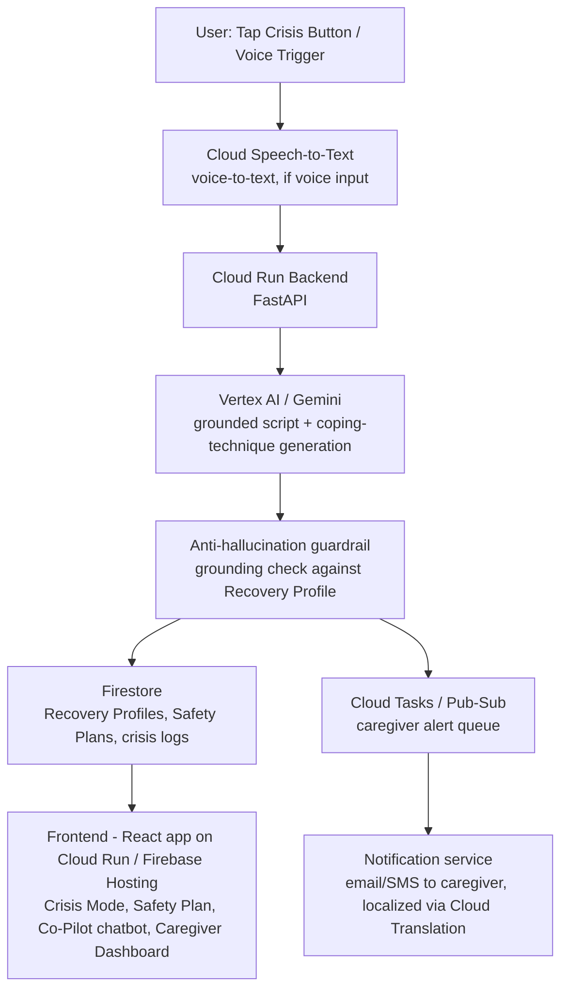

# Recovery & Prevention Hub — Project Specification

*A GenAI-powered recovery and prevention platform for individuals navigating substance use disorders and their caregivers.*

## TL;DR (For Judges)

| | |
|---|---|
| **What it is** | A multi-modal, GenAI-powered platform that provides zero-typing crisis interventions, personalized emergency scripts, educational resources, and contextual safety tools for people in recovery and their caregivers. |
| **Core differentiator** | **Zero-Typing Crisis Mode** — one tap/voice trigger generates a personalized emergency script, grounding exercise, and caregiver alert when cognitive load is highest (craving, panic, relapse risk). |
| **Stack** | 100% Google Cloud native — Vertex AI/Gemini, Cloud Speech-to-Text (voice-first input), Cloud Translation API, Cloud Run, Firestore, Firebase Hosting. |
| **Generative AI usage** | **Mandatory, not optional** (see [Section 4.8](#48-generative-ai-usage-mandatory)) — real Gemini calls power emergency script generation, craving-check-in triage, and the caregiver co-pilot chatbot; keyword heuristics alone do not satisfy this project's bar. |
| **Live Demo Integrity** | **Mandatory, not optional** (see [Section 4.9](#49-live-demo-integrity-mandatory--no-statichardcoded-content)) — the judged demo runs fully live against real Gemini, with zero pre-scripted "safe" responses. |
| **Demo in one line** | Tap the single crisis button with zero typing, watch Gemini generate a grounded, personalized emergency script live, alert a caregiver with context, then ask the recovery co-pilot a real question and get a grounded, hallucination-checked answer. |

## 1. Overview

**Product Name:** Recovery & Prevention Hub

**Tagline:** Support when cognitive load is highest — zero typing, always grounded.

### Problem Statement

Individuals navigating substance use disorders face moments of acute crisis — cravings, panic, early relapse warning signs — where typing, navigating menus, or searching for help is cognitively impossible. Caregivers and family members, meanwhile, often don't know what to say or do when a crisis unfolds, and lack a shared, real-time picture of their loved one's status. Generic hotline numbers and static pamphlets don't adapt to the person's specific triggers, history, or the moment's context. The result: preventable relapses, delayed intervention, and caregivers who feel helpless.

### Solution

Recovery & Prevention Hub is a multi-modal support platform that:

- Provides a **zero-typing crisis mode**: one tap or voice command triggers a GenAI-generated, personalized emergency script and grounding exercise
- Generates **personalized emergency scripts** grounded in the user's own recovery profile (triggers, coping strategies, support contacts) — never generic, never hallucinated
- Delivers **contextual safety tools**: craving check-ins, relapse-risk self-assessment, and immediate coping technique suggestions
- Connects to **caregivers** with real-time, context-rich alerts when a crisis is triggered — including what happened and what the caregiver should do next
- Backs every intervention with **educational resources** (grounded, cited, never fabricated) about substance use disorders, recovery stages, and support strategies
- Offers a **Recovery Co-Pilot chatbot** grounded strictly in the user's own logged history and curated educational content — refuses to answer ungrounded/unsafe questions rather than guessing
- Deploys entirely on Google Cloud Platform for scalability, reliability, and Vertex AI-native GenAI

## 2. Goals & Success Metrics

| Goal | Success Metric |
|---|---|
| Reduce time-to-support during crisis | Time from crisis trigger → emergency script + caregiver alert delivered < 30 seconds |
| Minimize cognitive load during crisis | Crisis Mode requires **zero typing** — one tap or one voice command end-to-end |
| Personalize every intervention | 100% of emergency scripts reference the user's actual logged triggers/coping plan, not generic text |
| Keep caregivers informed & actionable | 100% of crisis alerts include context + a suggested next action for the caregiver |
| Guarantee AI safety | 0% hallucinated clinical claims; every educational answer is grounded in curated content or explicitly says "I don't have grounded information about that — contact a professional" |
| Demonstrate GCP-native GenAI architecture | Fully deployed and functional on GCP infrastructure, real Gemini calls in the judged demo |

## 3. Core Features (MVP Scope)

### 3.1 Zero-Typing Crisis Mode (Core Differentiator)

- Single large "I need help now" button (and/or voice trigger via Cloud Speech-to-Text) — no forms, no typing required
- On trigger, Gemini generates a **personalized emergency script**: calming language, grounding technique (e.g. 5-4-3-2-1 senses exercise), and a reminder of the user's own coping plan and support contacts
- Emergency script is read aloud (text-to-speech ready) and displayed in large, high-contrast text
- One-tap escalation to call/alert a designated caregiver, with full context auto-attached

### 3.2 Personalized Emergency Scripts

- Grounded in the user's **Recovery Profile**: known triggers, past successful coping strategies, sobriety milestones, support contacts
- Gemini prompt explicitly forbids inventing clinical advice not present in the user's profile or the curated knowledge base
- Every script includes a visible "Grounded in: [profile fields used]" trace for transparency (anti-hallucination requirement)
- Confidence-scored: if the model cannot ground a script in real profile data, it falls back to a safe, clearly-labeled generic script rather than fabricating personal details

### 3.3 Contextual Safety Tools

- **Craving Check-In**: quick intensity self-rating (tap, not typing) → Gemini suggests the most relevant coping technique from the user's own successful-strategies history
- **Relapse-Risk Signals**: lightweight, tap-based mood/sleep/stress check-ins feed a risk indicator (rule-based + Gemini-summarized trend, never a clinical diagnosis)
- **Safety Plan**: structured, editable plan (triggers → warning signs → coping steps → support contacts → professional resources) that anchors every AI-generated response

### 3.4 Caregiver Connection & Alerts

- Caregivers get a real-time alert when the user triggers Crisis Mode, including: what triggered it (if shared), the emergency script sent to the user, and a **suggested next action** for the caregiver (e.g. "call now," "send a supportive text," "no action needed, user chose self-guided grounding")
- Caregiver dashboard shows sobriety milestones, recent check-ins (with user-controlled sharing granularity), and past alerts/outcomes
- Acknowledgment tracking: caregiver confirms they've seen and responded to an alert

### 3.5 Recovery Co-Pilot Chatbot (Grounded Q&A)

- Natural-language Q&A grounded strictly in: (a) the user's own Safety Plan / logged history, and (b) a curated educational knowledge base (substance use disorder facts, recovery-stage guidance)
- Returns an answer + source citation (which profile field or knowledge-base entry it drew from)
- **Must explicitly decline** to answer when the question requires clinical/medical judgment beyond the grounded content — routes to "contact your care team" instead of guessing (anti-hallucination requirement, spec.md Section 4.9)
- Available to both the individual and (with permission) their caregiver

### 3.6 Educational Resource Library

- Curated, versioned educational content on substance use disorders, recovery stages, and caregiver support strategies
- Gemini-generated **plain-language summaries** of longer resources, always citing the source resource — never inventing new clinical facts
- Multi-language support via Cloud Translation API for non-English speakers and caregivers

### 3.7 Multi-Modal, Multi-Language Access

- Voice-first interaction for Crisis Mode (Cloud Speech-to-Text) so a user in acute distress never has to type
- Auto-translate emergency scripts, educational content, and caregiver alerts into the user's/caregiver's preferred language
- High-contrast, large-text, screen-reader-first UI (accessibility is safety-critical here, not a nice-to-have)

## 4. Non-Functional Requirements (Judging Criteria Alignment)

> **Target Score:** Judges expect a score above **96/100** across this section for the project to be selected. Every sub-section below must be treated as a hard requirement, not a nice-to-have — no partial-credit shortcuts on code quality, security, testing, accessibility, generative AI usage, or live demo integrity.

### 4.1 Code Quality

- Modular architecture: separate services for crisis-script generation, safety-plan grounding, caregiver alerting, translation, and frontend
- Consistent linting (ESLint/Prettier for frontend, Black/Flake8 for Python backend)
- Clear README with setup instructions and architecture diagram

### 4.2 Efficiency

- Batch/streamed AI calls where possible; avoid redundant Gemini calls for repeated identical check-ins
- Caching of educational content translations to support repeated access without re-processing
- Asynchronous processing for caregiver alert delivery (non-blocking UI, job queue via Cloud Tasks/Pub/Sub)

### 4.3 Accessibility

- WCAG 2.1 AA-aligned frontend: sufficient color contrast, ARIA labels, keyboard navigation
- Crisis Mode specifically: large tap targets, minimal steps, voice-first option, no required reading before help arrives
- Status indicators use icon + text + color (not color alone)
- Multi-language support serves both accessibility and caregiver-inclusion goals

### 4.4 Security & Safety

- Secrets managed via Google Secret Manager (no hardcoded API keys)
- Data encrypted in transit (HTTPS/TLS) and at rest (GCP default encryption + Firestore encryption)
- Role-based access control: only the individual and their explicitly-linked caregiver(s) can access a given Recovery Profile, Safety Plan, or crisis history
- Input sanitization on all user-submitted fields
- Audit log for access to sensitive recovery/health data
- **Safety-critical guardrail:** the system must never present itself as a substitute for emergency services — every Crisis Mode screen displays how to reach real emergency/crisis-line services, and the AI must never discourage a user from seeking professional/emergency help

### 4.5 Testing

- Unit tests for core logic: emergency script grounding, anti-hallucination rejection of ungrounded/fabricated content, caregiver alert triggering, craving-check-in coping-technique matching
- Edge case tests: empty/incomplete Recovery Profile, failed Gemini call fallback, no caregiver linked, unsupported language fallback
- Integration test: end-to-end flow from crisis trigger → grounded script generated → caregiver alert sent
- Manual test log documented in `TESTING.md` for scenarios not automated due to time constraints

### 4.6 Problem Statement Alignment

- Every feature explicitly maps back to the core problem: "cognitive load is highest exactly when the person needs the most support, and typing/navigating is the wrong interaction model"
- Zero-typing Crisis Mode and personalized emergency scripts are the primary demo narrative
- Caregiver connection directly addresses the "family members feel helpless" pain point

### 4.7 Google Services Usage

- Solution must be built predominantly on Google Cloud Platform native services (not just hosted on GCP, but architecturally leveraging its AI/ML and infrastructure offerings)
- Core AI capabilities (emergency script generation, craving-check-in triage, Recovery Co-Pilot Q&A, educational summarization, translation) powered by Google's AI stack: Vertex AI/Gemini, Cloud Translation API, Cloud Speech-to-Text
- Avoid third-party AI/ML alternatives where a GCP-native equivalent exists
- Justify any non-Google service used, with a clear rationale, and document as a stretch-goal migration if time permits
- Generative AI usage specifically is **mandatory** — see Section 4.8. It is not sufficient to describe Vertex AI/Gemini in the architecture diagram without a working, tested code path that actually calls it.

### 4.8 Generative AI Usage (Mandatory)

> **This is a hard pass/fail requirement, not a stretch goal.** A submission that only performs keyword/regex matching — even if the UI *looks* AI-powered — does not satisfy this project's bar. Every core AI capability listed below must be demonstrably backed by a real generative model, with working, tested code, not a documented "next step."

- The following capabilities **MUST** be backed by a real generative model call (Vertex AI / Gemini), with code that actually invokes the model and has been exercised by an automated test:
  - Personalized emergency script generation (Section 3.2)
  - Craving check-in coping-technique suggestion (Section 3.3)
  - Recovery Co-Pilot chatbot Q&A (Section 3.5)
  - Educational resource plain-language summarization (Section 3.6)
- `USE_MOCK_AI=true` may remain the **default** for local development and automated tests, so a missing/invalid credential never breaks CI. But the real-GenAI code path itself is not allowed to be unimplemented or a TODO — it must exist in `app/services/ai_services.py`, run end-to-end against Vertex AI when `USE_MOCK_AI=false`, and be covered by unit tests that mock only the network call (the model boundary), not the surrounding integration logic.
- Deterministic keyword/rule-based heuristics are permitted only as: (1) the offline/mock fallback under `USE_MOCK_AI=true`, and (2) a safety-net fallback if a live model response fails to parse — never as the sole implementation of a capability listed above.
- Prompts must ground responses in the user's Recovery Profile / curated knowledge base (no hallucinated clinical content) and request structured (JSON) output where applicable.
- Any team demoing this project must be able to answer "show me the real Gemini call" by pointing at working code, a passing automated test that exercises it, and a live run with `USE_MOCK_AI=false`.

### 4.9 Live Demo Integrity (Mandatory — No Static/Hardcoded Content)

> **Judging requirement:** the judged demo must be fully live. Static/hardcoded pages, canned mock data presented as if live, false-positive results, and hallucinated AI responses are all explicit failures, not stylistic nitpicks.

- The demo environment must run with `USE_MOCK_AI=false` against real Vertex AI Gemini — no `[MOCK ...]`-prefixed output may appear on screen during judging.
- The presenter must trigger Crisis Mode **live, in front of judges**, using a real (unscripted or lightly prepared) Recovery Profile, and the resulting emergency script, coping suggestion, and caregiver alert must all be generated in real time — not read from a pre-seeded fixture.
- `SEED_DEMO_DATA=false` must be set for the judged environment so the app starts with a real (self-created, live) user profile and zero pre-written crisis scripts/chat answers.
- Anti-hallucination guardrails are mandatory in code, not just prompt wording: emergency scripts and chatbot answers must be verified as grounded in the user's actual profile/knowledge base before being surfaced; ungrounded content is rejected and replaced with an explicit "I don't have grounded information for that" response — the system must never fabricate a clinical claim or a fake support contact.
- "False positives" (e.g. a script referencing a coping strategy the user never logged, a caregiver alert with fabricated context, a chatbot inventing a fact) discovered during a live run must fail the demo run, not be silently accepted — rehearse with real, unscripted profiles beforehand specifically to surface these.
- `demo_data/` and `USE_MOCK_AI=true` remain valid for **local development and automated tests only** — never for the judged live session itself.

## 5. Technical Architecture

### 5.1 High-Level Flow

### 5.2 Google Cloud Services Used

| Service | Purpose |
|---|---|
| Vertex AI / Gemini API | Emergency script generation, craving-check-in coping suggestions, Recovery Co-Pilot Q&A, educational summarization |
| Cloud Speech-to-Text | Voice-first crisis trigger and voice input for zero-typing interaction |
| Cloud Translation API | Translate emergency scripts, educational content, and alerts into user's/caregiver's preferred language |
| Cloud Run | Host backend API services (containerized, scalable) |
| Firestore (or in-memory dev store) | Structured data: recovery profiles, safety plans, crisis logs, caregiver links |
| Cloud Tasks / Pub/Sub | Async job queue for caregiver alert delivery |
| Secret Manager | Secure storage of credentials |
| Firebase Hosting / Cloud Run | Frontend deployment |
| Cloud IAM | Role-based access control |
| Cloud Logging/Monitoring | Observability, audit logs, error tracking |

### 5.3 Data Model (Simplified)

**User**
- `id`, `name`, `email`, `role` (`individual`/`caregiver`), `preferred_language`, `linked_user_ids[]` (caregiver↔individual link)

**RecoveryProfile**
- `id`, `user_id`, `triggers[]`, `coping_strategies[]`, `support_contacts[]`, `sobriety_start_date`, `notes`

**CrisisEvent**
- `id`, `user_id`, `triggered_at`, `trigger_method` (`tap`/`voice`), `generated_script`, `grounded_fields[]`, `caregiver_alert_id`, `status` (`open`/`resolved`)

**CaregiverAlert**
- `id`, `crisis_event_id`, `caregiver_id`, `context_summary`, `suggested_action`, `sent_at`, `acknowledged_at`, `language_used`

**CheckIn**
- `id`, `user_id`, `type` (`craving`/`mood`/`sleep`/`stress`), `intensity`, `suggested_technique`, `created_at`

## 6. Demo Flow (For Judging — Fully Live, No Static/Hardcoded Content)

1. Start the deployed environment with `SEED_DEMO_DATA=false` and `USE_MOCK_AI=false` — the app opens with an empty crisis history except for real user accounts.
2. Live, in front of judges: create a real (unscripted or lightly prepared) Recovery Profile — a few triggers, coping strategies, one support contact.
3. Tap the single "I need help now" Crisis Mode button (zero typing) — the backend calls Gemini live to generate a personalized emergency script grounded in that profile, with a visible "Grounded in: ..." trace.
4. Show the live caregiver alert generated with context + suggested next action.
5. Open the Recovery Co-Pilot chatbot and ask a real, unscripted question grounded in the profile; then ask an ungrounded/unsafe question live and show the guardrail response ("I don't have grounded information for that — contact your care team") rather than a fabricated answer.
6. Show a Craving Check-In tap flow and the live-generated coping-technique suggestion.
7. Show the GCP Console live (Cloud Run logs, Vertex AI usage) confirming the calls made in steps 3–6 actually hit real GCP services.
8. Close with a summary slide mapping features → judging criteria, explicitly noting every artifact shown was generated during the session, not pre-loaded.

### 6.5 Local Development & Test Data (Not Used in Judged Demo)

`demo_data/` and `USE_MOCK_AI=true` exist solely to support local development and the automated test suite without requiring live GCP credentials on every `pytest` run. They must **not** be enabled during the judged session (Section 4.9).

## 7. Stretch Goals (If Time Permits)

- Wearable/passive signal integration (heart rate, sleep) feeding relapse-risk indicators
- Peer support matching (grounded, opt-in, privacy-preserving)
- Multi-caregiver coordination (more than one linked caregiver, shared view)
- Voice-only full navigation (not just Crisis Mode trigger)

## 8. Out of Scope (For Hackathon MVP)

- Native mobile app (PWA-style responsive web is in scope)
- Clinical diagnosis or treatment planning (explicitly out of scope and guarded against — see Section 4.4/4.9)
- Integration with real EHR/clinical systems

## 9. Why This Wins

| Differentiator | Why Judges Should Care |
|---|---|
| **Zero-typing is the actual product, not a UI nicety** | Most wellness apps assume the user can navigate a form. We solve for the moment that assumption breaks down — active crisis. |
| **Grounding is enforced in code, not just prompts** | Every emergency script and chatbot answer is checked against the user's real profile/knowledge base before being shown; ungrounded content is rejected, not softened with a disclaimer. |
| **Caregivers are a first-class user, not an afterthought** | Real-time, context-rich alerts with a suggested next action turn "I don't know what to do" into a concrete, safe action. |
| **Built entirely on GCP's AI stack** | Vertex AI/Gemini, Speech-to-Text, and Translation API work together in one coherent, safety-guarded pipeline. |
| **Live-demo honesty by design** | No pre-loaded "safe" demo data — every artifact judges see is generated live, proving the guardrails work under real conditions, not just in a script. |

## 10. Team Roles (Fill In)

| Name | Role | Responsibility |
|---|---|---|
|  | Backend/AI | Grounded generation pipeline, anti-hallucination guardrails, GCP setup |
|  | Frontend | Crisis Mode UI, Safety Plan, Co-Pilot chatbot UI, Caregiver Dashboard |
|  | DevOps/Cloud | GCP deployment, IAM, Secret Manager, CI/CD |
|  | Product/Pitch | Demo script, slides, judging criteria mapping, live-demo rehearsal |

## 11. Appendix: Judging Criteria Quick Reference

> **Scoring bar:** Section 4 (Non-Functional Requirements) must score **96+/100** to qualify for selection. Treat every row below as pass/fail, not best-effort.

| Criteria | How We Address It |
|---|---|
| Code Quality | Modular services, linting, clear README |
| Efficiency | Cached translations, async caregiver alert queue |
| Accessibility | WCAG-aligned UI, zero-typing/voice-first Crisis Mode, multi-language support |
| Problem Alignment | Every feature ties to "cognitive load is highest exactly when support is needed most" |
| Security & Safety | Secret Manager, IAM access control, encrypted data, never-discourage-professional-help guardrail |
| Testing | Unit + integration tests, documented manual test cases |
| Cloud Deployment | Fully built on GCP (Vertex AI, Speech-to-Text, Translation API, Cloud Run, Firestore) |
| Generative AI Usage (mandatory) | Real Gemini calls — not just keyword heuristics — power script generation, coping suggestions, and chatbot Q&A; see Section 4.8 |
| Live Demo Integrity (mandatory) | Fully live judged session — no static/hardcoded pages, no mock data, no false positives, no hallucinated AI responses; see Section 4.9 |
